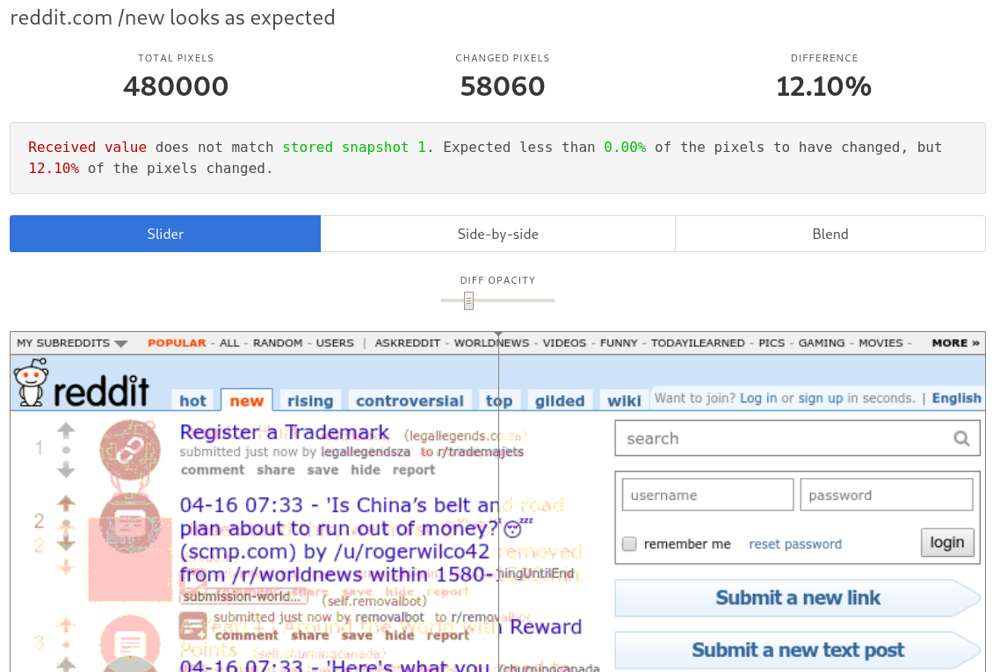

# jest-screenshot

[](https://www.npmjs.com/package/jest-screenshot)
[](https://travis-ci.org/Prior99/jest-screenshot)
[](https://coveralls.io/github/Prior99/jest-screenshot?branch=master)

A jest extension to deal with screenshots and all sorts of images. Inspired by the awesome [jest-image-snapshot](https://github.com/americanexpress/jest-image-snapshot) and
providing a mostly compatible API with similar features. By utilizing [native-image-diff](https://github.com/Prior99/native-image-diff) instead of [pixelmatch](https://github.com/mapbox/pixelmatch)
and [node-libpng](https://github.com/Prior99/node-libpng) instead of [pngjs](https://github.com/lukeapage/pngjs) the tests will run much faster than its competitor.

Please also refer to the **[Documentation](https://prior99.github.io/jest-screenshot/docs/index.html)**.

## Table of contents

 * [jest-screenshot](#jest-screenshot)
    * [Table of contents](#table-of-contents)
    * [Installation](#installation)
        * [Installing the expect extension](#installing-the-expect-extension)
        * [Installing the reporter](#installing-the-reporter)
        * [Configuring](#configuring)
            * [Example](#example)
    * [Usage](#usage)
    * [Benchmark](#benchmark)
    * [Reports](#reports)
    * [Contributing](#contributing)
    * [Contributors](#contributors)

## Installation

Two steps are necessary in order to use this plugin:

 1. Install the `expect().toMatchImageSnapshot()` extension. ([Here](#installing-the-expect-extension))
 2. Install the reporter. ([Here](#installing-the-reporter))

### Installing the expect extension

Integrate this plugin by calling `setupJestScreenshot` in the framework setup file:

```typescript
import { setupJestScreenshot } from "jest-screenshot";

setupJestScreenshot();
```

Store the above code in a `setup-framework.js` file and specify it when configuring Jest:

```json
"jest": {

    "setupTestFrameworkScriptFile": "<rootDir>/setup-framework.js"

}
```

### Installing the reporter

In order to generate the report, the reporter must be registered in the Jest configuration:

```json
"jest": {

    "reporters": [
        "default",
        "jest-screenshot/reporter"
    ]

}
```

### Configuring

By placing a file **jest-screenshot.json** in the root directory of your project with a [configuration object](https://prior99.github.io/jest-screenshot/docs/interfaces/jestscreenshotconfiguration.html)
you can configure it:

| Parameter                | type     | default                  | Description
|--------------------------|----------|--------------------------|-----------------------------------------|
| `detectAntialiasing`     | boolean  | `true`                   | Whether to attempt to detect antialiasing and ignore related changes when comparing both images. [See documentation](https://prior99.github.io/native-image-diff/docs/interfaces/diffimagesarguments.html#detectantialiasing). |
| `colorThreshold`         | number   | `0.1`                    | A number in the range from `0` to `1` describing how sensitive the comparison of two pixels should be. [See documentation](https://prior99.github.io/native-image-diff/docs/interfaces/diffimagesarguments.html#colorthreshold). |
| `pixelThresholdAbsolute` | number   | `undefined`              | If specified, **jest-screenshot** will fail if more than the specified pixels are different from the snapshot. |
| `pixelThresholdRelative` | number   | `0`                      | If specified, **jest-screenshot** will fail if more than the specified relative amount of pixels are different from the snapshot. When setting this to `0.5` for example, more than 50% of the pixels need to be different for the test to fail. |
| `snapshotsDir`           | string   | `__snapshots__`          | If specified, will change the directory into which the snapshot images will be stored, relative to the unit test file. |
| `reportDir`              | string   | `jest-screenshot-report` | If specified, will change the directory into which the HTML report will be written, relative to the project's root directory.  |
| `noReport`               | boolean  | `false`                  | Set this to `true` in order to completely disable the HTML report.  |

It's also possible to specify a key `jestScreenshot` in the **package.json** with the same interface.

All configuration options are optional.

If neither `pixelThresholdAbsolute` nor `pixelThresholdRelative` are specified, `pixelThresholdRelative` will be set to `0`.
Both can be specified together in order to make the test fail on both conditions.

#### Example

```json
{
    "detectAntialiasing": false,
    "colorThreshold": 0,
    "pixelThresholdAbsolute": 150,
    "pixelThresholdRelative": 0.5
};
```

The above config will make the tests fail if more than 150 pixels in total changed or more than 50% of the pixels changed.
It will detect any pixel as changed even if the color only differs minimally and antialiasing detection is disabled.

## Usage

Take a look at [the example project](example/).

This library can be used to compare images with snapshots:

```typescript
describe("My fancy image", () => {
    const myFancyImage = readFileSync("../my-fancy-image.png");

    it("looks as beautiful as always", () => {
        expect(myFancyImage).toMatchImageSnapshot();
    });
});
```

This is for example useful for integration tests with [puppeteer](https://github.com/GoogleChrome/puppeteer):

```typescript
describe("My fancy webpage", () => {
    const page = ...; // Setup puppeteer.

    it("looks as gorgeous as ever", async () => {
        expect(await page.screenshot()).toMatchImageSnapshot();
    });
});
```

## Benchmark

This library is around 10x faster than [jest-image-snapshot](https://github.com/americanexpress/jest-image-snapshot).

In the benchmark a whole unit test suite, including setup and teardown of the jest environment and 30 unit tests (10 matching,
10 not matching and 10 newly created) were measured. Writing of the report is also included.


The X axis displays the amount of executed suites per second.

In average:

 * **jest-screenshot** took **~9 seconds** for 30 tests and
 * **jest-image-snapshot** took **>100 seconds**.

## Reports

An HTML report with interactive tools for comparing the failed snapshots will be generated if any tests failed.

**[A demo can be found here](https://prior99.github.io/jest-screenshot/report-demo).**

They might look for example like this:



The report will be placed in a `jest-screenshot-report` directory in the project's root directory by default.

## Contributing

Yarn is used instead of npm, so make sure it is installed. `npm install -g yarn`.

Generally, it should be enough to just run:

```
make
```

which will install all node dependencies, compile typescript, execute all test,
lint the sources and build the docs.

## Contributors

 - Frederick Gnodtke
